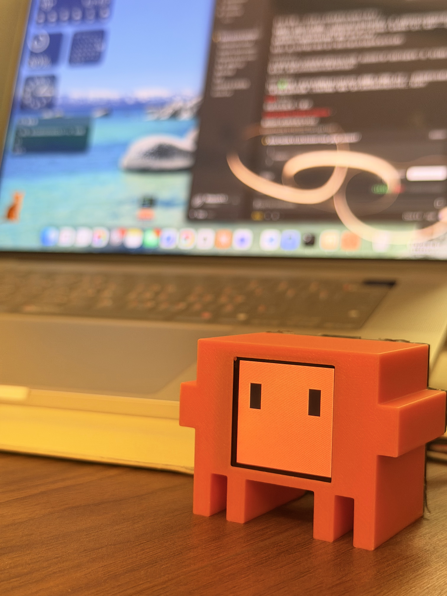

# Clawd Mochi — Companion Edition 🦀🐱

<p align="center"></p>

A desk pet built on an **ESP32-C3 + 1.54" ST7789** display that reacts to your
**Claude Code** session in real time — it shows a "working" face while Claude
runs tools, a random cute face when it finishes, gets sleepy when idle, and
blinks / glances around on its own. ~15 expressions, no app, no cloud.

> **Hi, I'm Yara 👋** — I built this little guy, and after I posted it online so
> many people asked how to make their own that I decided to open-source it.
> None of it would exist without **Yousuf Amanuel's** original Clawd Mochi —
> thank you for sharing it! 🙏 I hope you have as much fun building yours.

> ### Credit / 致谢
> This is a fork & extension of **[yousifamanuel/clawd-mochi](https://github.com/yousifamanuel/clawd-mochi)**
> by Yousif Amanuel. The hardware, wiring and the original firmware/idea are
> theirs — huge thanks! Please ⭐ the original project too.
>
> Original code is **MIT**; the 3D models are **CC BY-NC-SA 4.0** (attribution,
> non-commercial, share-alike). This fork keeps the same licenses.

> ⚠️ Independent fan project — **not affiliated with, sponsored by, or endorsed
> by Anthropic**. "Claude" and "Clawd" are trademarks of Anthropic.

---

## What's new in this edition

On top of the original (animated eyes + phone web controller), this fork adds:

- **Joins your home WiFi (STA mode)** instead of being its own hotspot — so your
  computer keeps internet while controlling it. Shows its IP + `clawd.local` on boot.
- **Claude Code companion** — via Claude Code *hooks*, the pet reacts to your session:
  - 😣 **working face** while Claude runs a tool
  - 🎲 **random cute face** when Claude finishes a reply
  - 😵 **X / dizzy eyes** when a tool fails
  - ❤️ **heart eyes** at session start
  - 😴 **sleepy `zZ`** after 60 s idle
- **~15 expressions**: normal · squish · working · sleepy · surprised · heart ·
  dizzy · wink · happy · angry · sad(tear) · star-eyes · blush · cool(sunglasses).
- **Live idle**: blinks periodically and glances left/right when resting.
- **Auto-show on boot** (info screen → eyes after ~4 s), so it "just works" on a charger.
- **mDNS** — reach it at `http://clawd.local` (no need to track the IP).

---

## Parts

| Part | Spec | ~Price |
|---|---|---|
| ESP32-C3 SuperMini | MCU with WiFi (USB-C), **soldered headers** | ~$2.5 |
| 1.54" ST7789 TFT | 240×240 SPI, **8-pin** (with CS) | ~$3 |
| Female–female jumper wires | ×8, 10 cm | ~$0.5 |
| USB-C **data** cable | flashing + power | — |
| 3D printed case (body + back) | PLA, ~30 g | ~$0.5 |
| Self-tapping screws | **see Assembly note** ↓ | ~$1 |

> ESP32-C3 is **2.4 GHz only** — it cannot join a 5 GHz network.

---

## Wiring

> Connect **VCC to 3V3 only — never 5V**. SPI uses GPIO 8 (SCK) and 10 (MOSI).

| Display | ESP32-C3 | Wire |
|---|---|---|
| VCC | **3V3** ⚠️ | red |
| GND | GND | black |
| SDA | GPIO **10** | orange |
| SCL | GPIO **8** | green |
| RES/RST | GPIO **2** | purple |
| DC | GPIO **1** | blue |
| CS | GPIO **4** | white |
| BL | GPIO **3** | yellow |

With pre-soldered male pins on both boards + female-female jumpers, **no
soldering is needed**.

---

## 3D printed case

Print the case (body + back) from the **original project** — please download it
there rather than re-hosting, since the models are **CC BY-NC-SA 4.0**:

- GitHub: <https://github.com/yousifamanuel/clawd-mochi> → `models/clawd_mochi/`
- MakerWorld: <https://makerworld.com/en/models/2559505-clawd-mochi-physical-claude-code-mascot>

PLA/PETG, ~0.15–0.2 mm layers, 15% infill, supports for the screen window.

## Assembly & the screw gotcha 🔩

- **Display (front):** sits in the orange body's window. You can secure it with
  2× M2 screws through the bezel holes **or** just press-fit it + a dab of
  double-sided tape (the back plate holds it in place).
- **Back plate:** held by **2 small self-tapping screws into the body posts**
  (this case has screw holes, not snap clips).
- ⚠️ **The screw size:** the commonly-listed **M2×6 is too big** for the printed
  holes (ours measured ~1.4 mm). Use **M1.4 or M1.7 self-tapping (PA) screws**
  instead — tip: gauge the hole with a small screwdriver bit (a Torx **T3/T4**
  tip fit ours). **No nuts needed** — self-tapping screws bite straight into the
  plastic.
- **Heads-up on bulk:** female Dupont connectors are thick; the back can be a
  tight fit. Bend the connectors flat, or print a slightly deeper back, or
  solder thin wires if you want it slim.

---

## Flashing

### Arduino IDE
1. Install **Arduino IDE 2.x** and add ESP32 board support
   (Boards Manager URL: `https://espressif.github.io/arduino-esp32/package_esp32_index.json`).
2. Library Manager → install **Adafruit GFX** and **Adafruit ST7735 and ST7789**.
3. **Edit your WiFi** near the top of `clawd_mochi_companion/clawd_mochi_companion.ino`:
   ```cpp
   const char* STA_SSID = "YOUR_WIFI_2.4G";
   const char* STA_PASS = "YOUR_WIFI_PASSWORD";
   ```
4. Tools → Board **ESP32C3 Dev Module**, **USB CDC On Boot: Enabled**,
   160 MHz, 921600. Select the port, click **Upload**.
5. On boot the screen shows its IP + `clawd.local`, then the eyes appear.

### arduino-cli
```bash
arduino-cli compile --upload -p <PORT> \
  --fqbn "esp32:esp32:esp32c3:CDCOnBoot=cdc,CPUFreq=160,UploadSpeed=921600" \
  clawd_mochi_companion
```

---

## Claude Code companion setup

1. Put `companion/clawd_cmd.sh` somewhere and make it executable:
   ```bash
   chmod +x /PATH/TO/companion/clawd_cmd.sh
   ```
   (If `clawd.local` is flaky on your network, set `HOST_IP` in the script to the
   IP shown on the device screen.)
2. Add the hooks from `companion/hooks-example.json` to your Claude Code
   `settings.json` (replace `/PATH/TO`). **Merge** into existing event arrays if
   you already have hooks.
3. Restart Claude Code (or reload settings). Now the pet reacts as you work.

> Hooks run a short `curl` to the device. Keep it **synchronous** (no `&`) —
> a backgrounded curl gets killed before it sends.

---

## Expression / command reference

`GET http://<device>/cmd?k=<letter>`

| k | expression | | k | expression |
|---|---|---|---|---|
| `w` | normal eyes | | `i` | wink |
| `s` | squish `> <` | | `p` | happy |
| `k` | working (`...`) | | `g` | angry |
| `z` | sleepy `zZ` | | `b` | sad (tear) |
| `o` | surprised | | `e` | star eyes |
| `l` | heart eyes | | `h` | blush |
| `x` | dizzy `X X` | | `n` | sunglasses |
| `q` | exit terminal mode | | `d` | (terminal view, legacy) |

The phone/desktop web controller is at `http://clawd.local` (or the device IP).

---

## License

- Code: **MIT** (see [LICENSE](LICENSE)) — includes the original copyright.
- 3D models / media (from the upstream project): **CC BY-NC-SA 4.0**.

Built with help from Claude. Original project by Yousif Amanuel.
